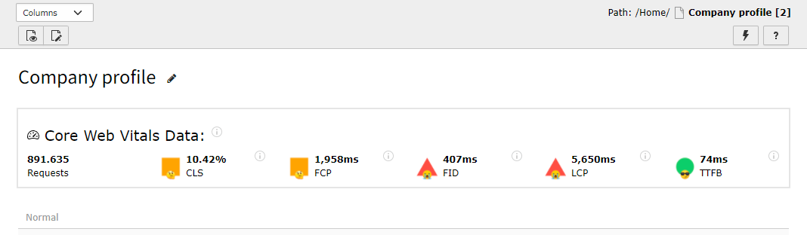
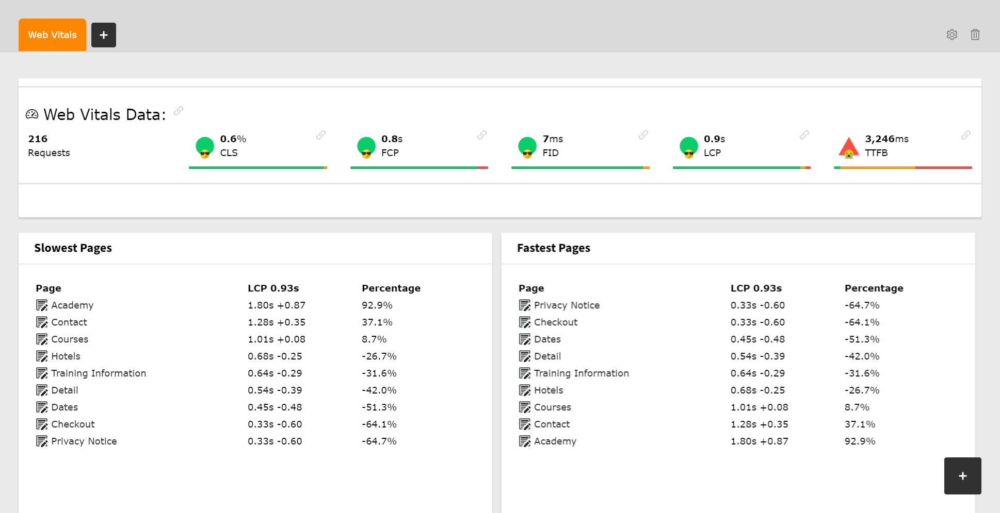

# Web Vitals Tracker 🔺🟨🟢

Real Measurement Web Vitals Statistic for your TYPO3  
_[More information about Web Vitals](https://web.dev/vitals/)_

## install 🎁

```composer req kanti/web-vitals-tracker```

Or via [the Extension Reposiotry](https://extensions.typo3.org/extension/web_vitals_tracker)

## How does it work 🦾

We inject a small javascript file _(2.6kb gziped)_ into the frontend,  
that uses the [web-vitals package](https://www.npmjs.com/package/web-vitals) to collect the timings of every page request.  
The data is sent to the TYPO3 and saved in the database.

## how does it look like 👀



### For TYPO3 10 and 11 the Dashboard:


## How to contribute 🤝

```
cd public/typo3conf/ext
git clone git@github.com:Kanti/web-vitals.git
cd web-vitals
# change your stuff
composer update
git commit -m '✨ fancy message that explains what was done and why'
# hint: use https://gitmoji.dev/ for a colorful commit message
git remote set-url origin git@github.com:<yourName>/web-vitals-tracker.git
git push
# create PR
```
## Get support 🆘

currently, the only support you can ask for is a  [github Issue](https://github.com/Kanti/web-vitals/issues?q=)

## Open Questions ❓

- what about Sites with a lot of Traffic?  
after 1_000_000 requests MySQL gets pretty slow (1,2s on my Laptop)
- What about nice 404 Sites, will it still measure the web vitals for that page?
- what about Route Enhancers, how will we work with that?
- what should be configurable?
- Analytical output
  - is it useful to get the top 10 and flop 10 Pages of a Site?
  - is it useful to have a historical chart of some sort?
  - is it useful to have a top 10 and flop 10 List of Plugins/Content Elements?

## What I want to do 🗓️

- make it compatible with php 7.2? 7.3?
- save the requests of elder data in aggregate form (to allow large websites to use it)

## Author 🚶‍♂️

Matthias Vogel  
Made with Love 💕, in my spare time ⏲
